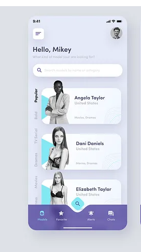
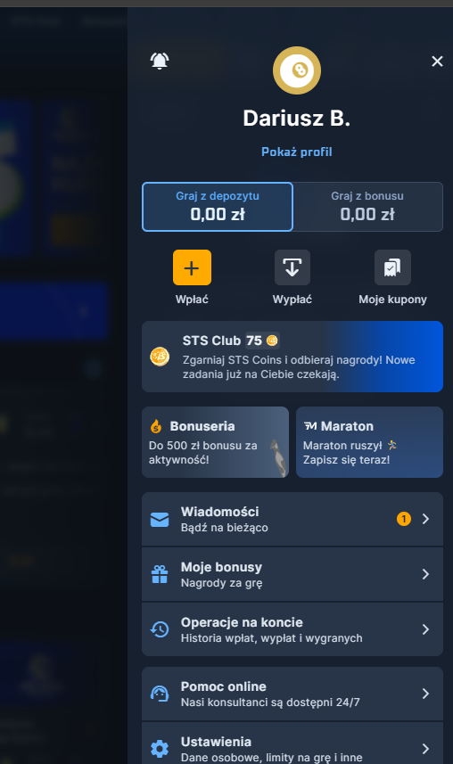

Potrzebuje przeeobic app-mobile-menu pod powyzsze zdjecie. Na dole będzie tylko strona główna, lista kuponów i ranking. U gory pozostanie zmiana języka i user

Trzeba przerobic aby zamiast dropdowna usera otwierał się z boku side menu z informacjami o userze.
